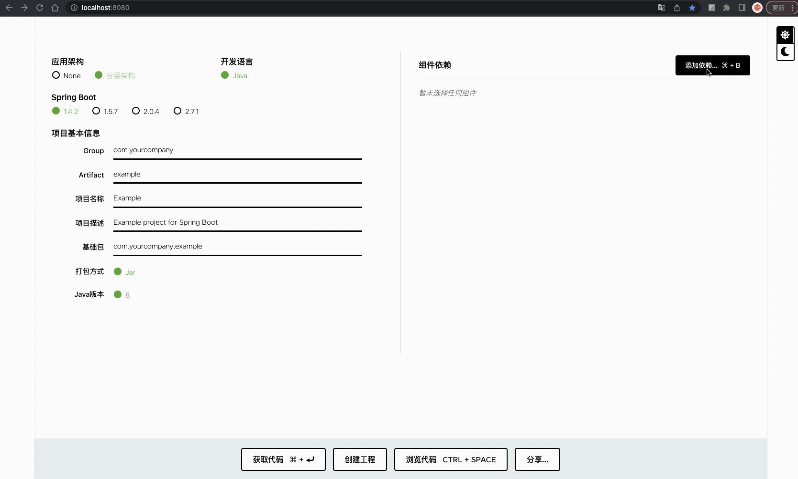
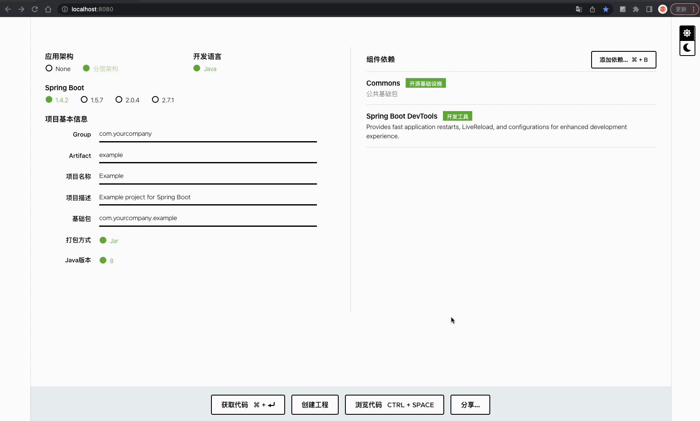
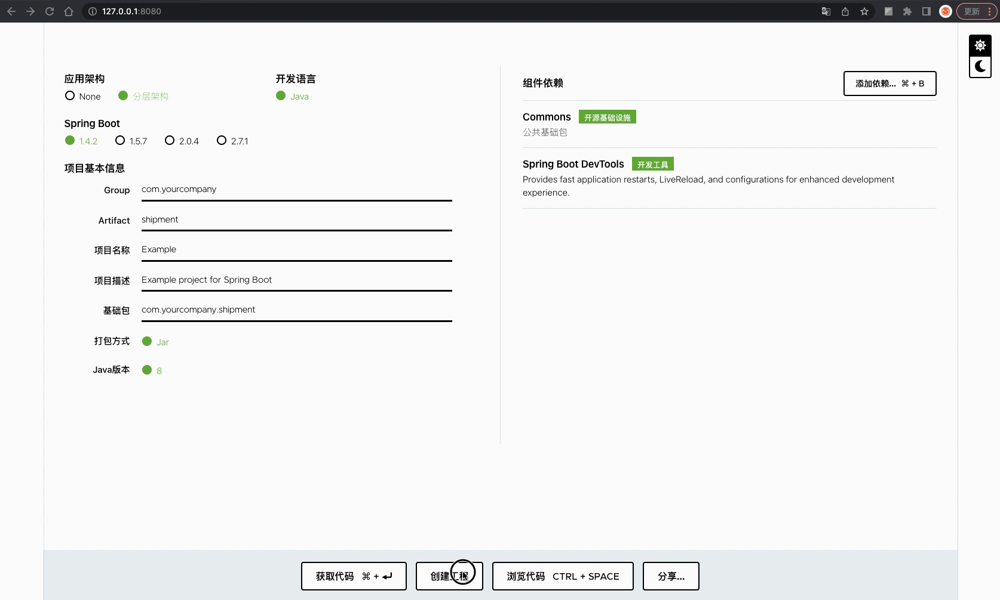

# 介绍

本工程基于 [start.spring.io](https://github.com/spring-io/start.spring.io) 开发，增加了分层应用架构，整合了公司自己的组件库，并且新开发了「创建工程」功能。

Build Required：
- Java: 17
- Maven: 3.8.3

### 【主界面】


### 【依赖管理】



### 【代码预览】



### 【创建工程】




# 快速体验

```shell
# 下载镜像
docker pull studeyang/start-site:0.0.2
# 运行容器
docker run -d \
  -p 8080:8080 \
  -e security.client-id=${client-id} \
  -e security.client-secret=${client-secret} \
  -e security.admin.name=${account} \
  -e security.admin.password=${password} \
  --name=start-site \
  studeyang/start-site:0.0.2
```

浏览器打开地址`http://localhost:8080`访问。

# 环境搭建

详细文档：[环境搭建](./docs/环境搭建.md)

# 设计实现

详细文档：[设计实现](./docs/设计实现.md)

# 联系作者


