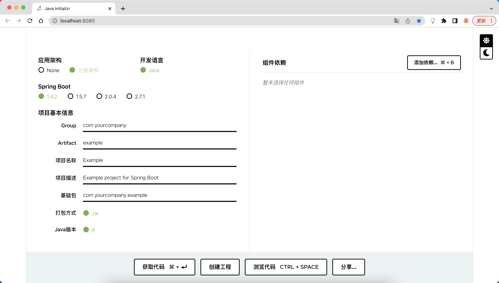
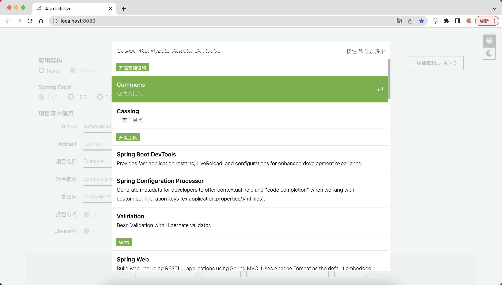
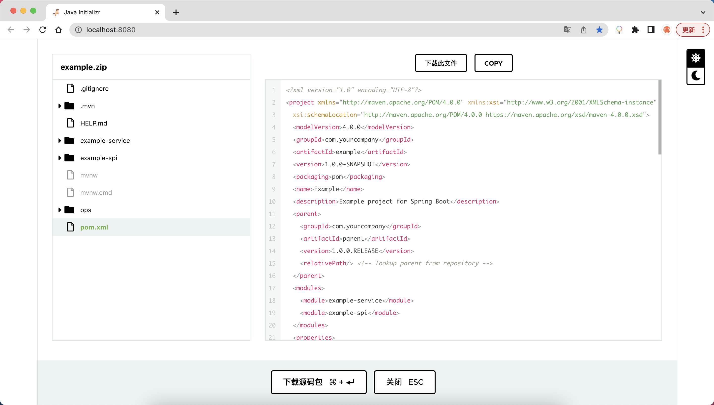

# 介绍

本工程基于 https://github.com/spring-io/start.spring.io 开发的，增加了分层应用架构，整合了公司自己的组件库，并且新开发了「创建工程」功能。界面预览图：

### 【主界面】

### 【依赖管理】

### 【代码预览】

# 环境搭建

详细文档：[环境搭建](./docs/环境搭建.md)

# 设计实现

详细文档：[设计实现](./docs/设计实现.md)

# 联系作者

